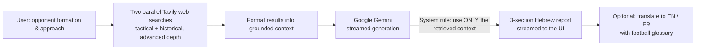

# Football Tactical Coach ⚽

A **RAG-powered tactical analysis tool**: describe an opponent's setup, and it researches the web in real time and generates a professional counter-tactics report — grounded in live sources, not generic AI guesswork.

Built with Next.js and Google Gemini, using Tavily for live web retrieval. A personal project born from a football scouting/analysis hobby.

## What it does

You enter four things about the opponent:
- **Defensive formation** (e.g. 4-4-2)
- **Offensive formation** (e.g. 3-4-3)
- **Defensive approach** (e.g. low block, high press)
- **Offensive approach** (e.g. counter-attack, possession)

…and get a structured, streamed report in Hebrew with three sections:
1. **סקירה טקטית** — a tactical breakdown of the opponent's system: strengths, weaknesses, structural vulnerabilities.
2. **איך מנצחים את זה** — concrete counter-tactics: recommended counter-formation, how to break down their defense, how to contain their attack, and key battles on the pitch.
3. **דוגמאות מהעבר** — real historical examples of teams that used a similar setup — what worked, what didn't.

The report can then be **translated to English or French** at the click of a button, using a professional football-terminology glossary (e.g. *Wing-backs → Pistons*, *High Press → Pressing haut*).

## How it works (RAG architecture)



**Retrieval-Augmented Generation (RAG)** is the core pattern: rather than asking the model to invent analysis, the app first **retrieves** real tactical and historical context from the web (two parallel [Tavily](https://tavily.com) searches — one tactical, one historical, both at `advanced` depth), then feeds that context to the model. The system prompt explicitly forbids generic analysis — the model must ground its answer in the retrieved sources.

## Notable engineering details

- **Streaming responses** — both the report and the translation stream token-by-token to the client via a `ReadableStream`, so the user sees output immediately instead of waiting for the full generation.
- **Model fallback chain** — tries `gemini-2.5-flash-lite` → `flash` → `pro`, automatically falling through on quota (`429`) or not-found (`404`) errors, so a rate-limited model degrades gracefully instead of failing.
- **Typed error handling** — distinguishes auth (`403`), quota (`429`), and other errors, returning actionable messages instead of a generic 500.
- **Parallel retrieval** — the two web searches run concurrently with `Promise.all` to cut latency.
- **Localized translation** — a per-language config (EN/FR) with a curated glossary of football terms, preserving all Markdown structure.

## Stack

| Layer | Tool |
|---|---|
| Framework | Next.js (App Router), React, TypeScript |
| LLM | Google Gemini (`@google/generative-ai`), streamed |
| Retrieval | Tavily web search API |
| UI | Tailwind CSS, `react-markdown`, lucide-react |

## Getting started

```bash
npm install
```

Create `.env.local`:

```
GOOGLE_AI_API_KEY=your_google_ai_studio_key
TAVILY_API_KEY=your_tavily_key
```

```bash
npm run dev
```

Open [http://localhost:3000](http://localhost:3000).

## Roadmap

- [ ] Hybrid retrieval — add Firecrawl alongside Tavily for deeper source extraction *(in progress)*
- [ ] Save and compare past tactical reports
- [ ] Visual formation diagrams

---

*Built by [Itay Shabtay](https://linkedin.com/in/itay-shabtay-aa5816348) — B.Sc. Computer Science. A scouting hobby turned into a RAG project.*
